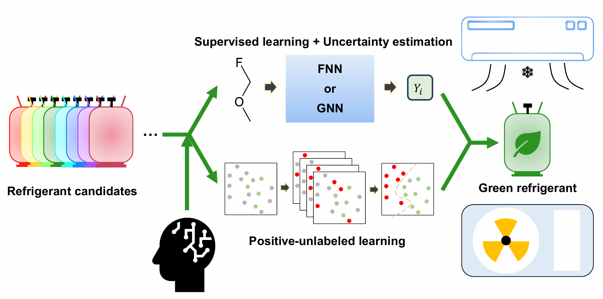

# Exploring Non-Toxic Green Refrigerants using Positive-Unlabeled Learning and High-Fidelity Search
***

### Repository for fully data-driven approach to Suggest Alternative Refrigerants

***

## Ⅰ: Create a new environment

>1. conda create -n gwp_env python=3.11
>1. conda activate gwp_env
>1. conda install pytorch==2.0.1 torchvision==0.15.2 torchaudio==2.0.2 pytorch-cuda=11.7 -c pytorch -c nvidia
>1. pip install torch_scatter torch_sparse torch_cluster torch_spline_conv torch-geometric -f https://data.pyg.org/whl/torch-2.0.1+cu117.html
>1. conda install pandas
>1. pip install -U scikit-learn
>1. pip install rdkit
>1. conda install openpyxl
>1. pip install pygments
>1. pip install pickle

***
## Ⅱ: Code execution

### 1. Run `exec_train_wore.py` (w/o RE data) and `exec_train_wre.py` (w/ RE data) to save the set of parameters in `./save` folder.
#### For `exec_train_wre.py`, using cuda is recommended; otherwise, it can take a lot of time due to the data amount.

### 2. Run `exec_predict.py` to predict the molecular properties of initial dataset by loading the set of parameters.
#### '.preds/supervised_result.xlsx' will be generated.

### 3. Run `exec_pu.py` to yield the safety score using positive-unlabeled learning.
#### '.preds/pu_result.xlsx' will be generated.
#### '.preds/pu_inserter.py' would be needed to arrange pu_result.xlsx into CID ascending order.

### 4. Run `exec_substructure.py` to find out which molecules have specific substructures which are not proper to be refrigerants.
#### '.preds/substructure_result.xlsx' will be generated.

### 5. Arrange three generated excel files to screen the refrigerant.

